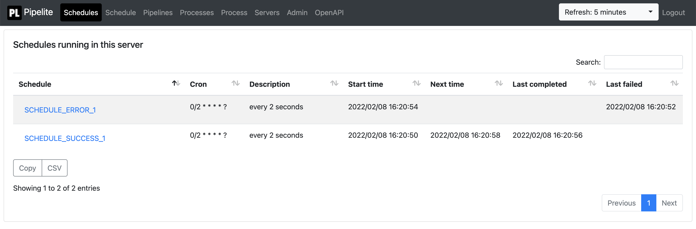

Pipelite workflow manager
=======
- [Overview](#overview)
- [How to start up Pipelite](#how-to-start-up-pipelite)
- [How to configure schedules](#how-to-configure-schedules)
    * [SimpleLsfExecutor example](#simplelsfexecutor-example)
- [How to configure pipelines](#how-to-configure-pipelines)
    * [SimpleLsfExecutor example](#simplelsfexecutor-example-1)
- [Stage dependency types](#stage-dependency-types)
- [Stage executor backends](#stage-executor-backends)
- [Configuration parameters](#configuration-parameters)
    * [Executor parameters](#executor-parameters)
        + [Cmd executor parameters](#cmd-executor-parameters)
        + [Simple LSF executor parameters](#simple-lsf-executor-parameters)
        + [LSF executor parameters](#lsf-executor-parameters)
        + [AwsBatch executor parameters](#awsbatch-executor-parameters)
    * [Service parameters](#service-parameters)
    * [Mail parameters](#mail-parameters)
    * [Database parameters](#database-parameters)
    * [Advanced parameters](#advanced-parameters)
    * [Test profiles](#test-profiles)
- [Database schema](#database-schema)
    * [PIPELITE2_SCHEDULE table](#pipelite2-schedule-table)
    * [PIPELITE2_PROCESS table](#pipelite2-process-table)
    * [PIPELITE2_STAGE table](#pipelite2-stage-table)
    * [PIPELITE2_STAGE_LOG table](#pipelite2-stage-log-table)
    * [PIPELITE2_SERVICE_LOCK table](#pipelite2-service-lock-table)
    * [PIPELITE2_PROCESS_LOCK table](#pipelite2-process-lock-table)
- [Web interface](#web-interface)
    * [Schedules](#schedules)
    * [Pipelines](#pipelines)
    * [Processes](#processes)
    * [Process](#process)
    * [Admin](#admin)

<small><i><a href='http://ecotrust-canada.github.io/markdown-toc/'>Table of contents generated with markdown-toc</a></i></small>


### Overview

Pipelite is a workflow manager that executes pipelines or schedules. Pipelines are used for parallel executions of
processes. Schedules are used for executing processes according to a cron schedule. Only one scheduled process can be
active for a pipeline at any given time.

Pipeline starts up a web service with a basic monitoring interface, takes care of the pipeline and schedule executions
and stores the execution state in a relational database.

### How to start up Pipelite

Pipelite is a Spring java application distributed as a regular maven jar archive. The jar should be added as a
dependency to a application that registers pipelines and schedules to be executed by Pipelite.

A minimal build.gradle could contain:

```gradle
plugins {
id 'org.springframework.boot' version '2.4.0'
id 'io.spring.dependency-management' version '1.0.10.RELEASE'
}

dependencies {
implementation 'org.springframework.boot:spring-boot-starter'
implementation 'pipelite:pipelite:1.0.89'
}
```

and the minimal application would call  ```Pipelite.main``` to start up the Pipelite services:

```java

@SpringBootApplication
public class Application {
    public static void main(String[] args) {
        Pipelite.main(args);
    }
}
```

### How to configure schedules

Schedules are used for executing processes according to a cron schedule.

Schedules are registered by implementing the ```Pipelite.Schedule``` interface and using the ```@Component```
annotation.

#### SimpleLsfExecutor example

A schedule executed using ```SimpleLsfExecutor``` over ssh would look like the following:

```java

@Component
public class MySchedule implements Pipelite.Schedule {

    @Override
    public String pipelineName() {
        // A unique name for the schedule.  
        return "MySchedule";
    }

    // The command line command to execute in STAGE1.
    private static final String STAGE_CMD1 = "...";

    // The command line command to execute in STAGE2.
    private static final String STAGE_CMD2 = "...";

    @Override
    public Options configurePipeline() {
        // The cron expression for the schedule.
        return new Options().cron("* * * * *");
    }

    @Override
    public void configureProcess(ProcessBuilder builder) {
        // A process with two stages is configured here. As the stages do not 
        // depend on each other they will be executed in parallel.
        builder
                // Execute STAGE1 stage that does not depend on any other stage.
                // Different executeXXX methods exist for different types of stage dependencies.
                .execute("STAGE1")
                // Execute STAGE1 using SimpleLsfExecutor with the provided stage execution parameters.
                // Different withXXX methods exist for different execution backends.
                .withSimpleLsfExecutor(STAGE_CMD1, STAGE_PARAMS)
                // Execute STAGE2 stage that does not depend on any other stage.
                // Different executeXXX methods exist for different types of stage dependencies.
                .execute("STAGE2")
                // Execute STAGE2 using SimpleLsfExecutor with the provided stage execution parameters.
                // Different withXXX methods exist for different execution backends.
                .withSimpleLsfExecutor(STAGE_CMD2, STAGE_PARAMS);
    }

    // SimpleLsfExecutor stage execution parameters are defined here. They can be shared
    // between stages or each stage can be configured with different parameters.
    private static final SimpleLsfExecutorParameters STAGE_PARAMS =
            SimpleLsfExecutorParameters.builder()
                    // How may times stages are immediately retried if their execution fails.
                    .immediateRetries(2)
                    // The maximum number of times a stage is retried if its execution fails.
                    // Applies only to pipelines.
                    .maximumRetries(5)
                    // The number of CPU cores required to execute the stage.
                    .cpu(1)
                    // The amount of memory in MBytes required to execute the stage.
                    .memory(16 /* MBytes */)
                    // The timeout after which the stage execution will be considered as failed.
                    .timeout(Duration.ofMinutes(30))
                    // The LSF login node.
                    .host("noah-login")
                    // The LSF queue.
                    .queue("production-rh74")
                    // The LSF working directoy where stage specific output files are written.
                    .workDir("pipelite_tmp")
                    .build();
}
```

### How to configure pipelines

Pipelines are used for executing unscheduled process instances.

Pipelilnes are registered by implementing the ```Pipelite.Pipeline``` interface and using the ```@Component```
annotation. 

When using the ```Pipelite.Pipeline``` interface the user is responsible for inserting new processes to be
executed into the ```PIPELITE2_PROCESS``` table. For example:

```sql
--  New process with default priority (5). Priority is between 9 (highest) and 0 (lowest).
insert into pipelite2_process(pipeline_name, process_id)
values ('testPipelite', 'testProcess1');


--  New process with priority 4. Priority is between 9 (highest) and 0 (lowest).
insert into pipelite2_process(pipeline_name, process_id, priority)
values ('testPipelite', 'testProcess2', 4);
```

#### SimpleLsfExecutor example

A pipeline executed using ```SimpleLsfExecutor``` over ssh would look like the following:

```java

@Component
public class MyPipeline implements Pipelite.Pipeline {

    @Override
    public String pipelineName() {
        // A unique name for the pipeline.  
        return "MyPipeline";
    }
    
    // The command line command to execute in STAGE1.
    private static final String STAGE_CMD1 = "...";

    // The command line command to execute in STAGE2.
    private static final String STAGE_CMD2 = "...";

    @Override
    public Options configurePipeline() {
        // The maximum number of parallel process executions.
        return new Options().pipelineParallelism(10);
    }

    @Override
    public void configureProcess(ProcessBuilder builder) {
        // A process with two stages is configured here. As the stages do not 
        // depend on each other they will be executed in parallel.
        builder
                // Execute STAGE1 stage that does not depend on any other stage.
                // Different executeXXX methods exist for different types of stage dependencies.
                .execute("STAGE1")
                // Execute STAGE1 using SimpleLsfExecutor with the provided stage execution parameters.
                // Different withXXX methods exist for different execution backends.
                .withSimpleLsfExecutor(STAGE_CMD1, STAGE_PARAMS)
                // Execute STAGE2 stage that does not depend on any other stage.
                // Different executeXXX methods exist for different types of stage dependencies.
                .execute("STAGE2")
                // Execute STAGE2 using SimpleLsfExecutor with the provided stage execution parameters.
                // Different withXXX methods exist for different execution backends.
                .withSimpleLsfExecutor(STAGE_CMD2, STAGE_PARAMS);
    }

    // SimpleLsfExecutor stage execution parameters are defined here. They can be shared
    // between stages or each stage can be configured with different parameters.
    private static final SimpleLsfExecutorParameters STAGE_PARAMS =
            SimpleLsfExecutorParameters.builder()
                    // How may times stages are immediately retried if their execution fails.
                    .immediateRetries(2)
                    // The maximum number of times a stage is retried if its execution fails.
                    // Stage executions are temporary stopped if immediate retries have 
                    // been exhausted and retried later until maximum retries is exceeded.
                    .maximumRetries(5)
                    // The number of CPU cores required to execute the stage.
                    .cpu(1)
                    // The amount of memory in MBytes required to execute the stage.
                    .memory(16 /* MBytes */)
                    // The timeout after which the stage execution will be considered as failed.
                    .timeout(Duration.ofMinutes(30))
                    // The LSF login node.
                    .host("noah-login")
                    // The LSF queue.
                    .queue("production-rh74")
                    // The LSF working directoy where stage specific output files are written.
                    .workDir("pipelite_tmp")
                    .build();
}
```

### Stage dependency types

The following dependency types are supported by the ProcessBuilder:

- ```execute(String stageName)```: the stage 'stageName' is not dependent on any other stage
- ```executeAfter(String stageName, String dependsOnStageName)```: the stage 'stageName' depends on stage '
  dependsOnStageName' and will be executed only after 'dependsOnStageName' has completed successfully
- ```executeAfter(String stageName, List<String> dependsOnStageName)```: the stage 'stageName' depends on a list of
  stages 'dependsOnStageName' and will be executed only after all 'dependsOnStageName' stages has completed successfully
- ```executeAfterPrevious(String stageName)```: the stage 'stageName' depends on the previous stage declared in the
  ProcessBuilder and will be executed only after it has completed successfully
- ```executeAfterFirst(String stageName)```:  the stage 'stageName' depends on the first stage declared in the
  ProcessBuilder and will be executed only after it has completed successfully

### Stage executor backends

The following executor backends are supported by the ProcessBuilder:

- ```withCmdExecutor```: a local or ssh command executor. Ssh will be used if ```host``` has been set
  in ```CmdExecutorParameters```.
- ```withLsfExecutor```: an LSF executor that uses YAML configuration files with parameter placeholders. Ssh will be
  used if ```host``` has been set in ```LsfExecutorParameters```.
- ```withSimpleLsfExecutor```: an LSF executor that uses a small subset of common LSF parameters. Ssh will be used
  if ```host``` has been set in ```SimpleLsfExecutorParameters```.
- ```withAwsBatchExecutor```: an experimental AwsBatch executor that uses JSON configuration files with parameter
  placeholders.
- ```with```: any executor that implements the ```StageExecutor``` interface.
- ```withCallExecutor```: any executor that implements the ```StageExecutorCall``` interface.
- ```withCallExecutor```: A test executor that behaves like a synchronous executor and returns the given stage state.
- ```withAsyncCallExecutor```: A test executor that behaves like an asynchronous executor by returning ACTIVE stage
  state when called for the first time and then returning the given stage state for subsequent calls.

### Configuration parameters

#### Executor parameters

Executor parameters provide default values for all ```ProcessBuilder``` stage parameters and are used in cases where the
value is not overriden in ```ProcessBuilder```.

##### Cmd executor parameters

- pipelite.executor.cmd.host: the remote host. Ssh will be used if the ```host``` has been set.
- pipelite.executor.cmd.user: the user used to connect to the remote host. Default value: the user who restarted the
  Pipelite service
- pipelite.executor.cmd.env: the environmental variables passed to the command executor
- pipelite.executor.cmd.workDir: the working directory where the output file and job definition files are written
- pipelite.executor.cmd.logBytes: the number of last bytes from the output file saved in the stage log

##### Simple LSF executor parameters

- pipelite.executor.simpleLsf.host: the remote host. Ssh will be used if the ```host``` has been set.
- pipelite.executor.simpleLsf.user: the user used to connect to the remote host. Default value: user who restarted the
  Pipelite service
- pipelite.executor.simpleLsf.env: the environmental variables passed to the command executor
- pipelite.executor.simpleLsf.workDir: the working directory where the output file and job definition files are written
- pipelite.executor.simpleLsf.logBytes: the number of last bytes from the output file saved in the stage log
- pipelite.executor.simpleLsf.queue: the queue name
- pipelite.executor.simpleLsf.cpu: the number of requested cpus (-n option)
- pipelite.executor.simpleLsf.memory: the amount of requested memory in MBytes (-M and -R rusage[mem=] option)
- pipelite.executor.simpleLsf.memoryTimeout: the LSF memory duration (-R rusage[mem=:duration=] option)

##### LSF executor parameters

- pipelite.executor.lsf.host: the remote host. Ssh will be used if the ```host``` has been set.
- pipelite.executor.lsf.user: the user used to connect to the remote host. Default value: user who restarted the
  Pipelite service
- pipelite.executor.lsf.env: the environmental variables passed to the command executor
- pipelite.executor.lsf.workDir: the working directory where the output file and job definition files are written
- pipelite.executor.lsf.logBytes: the number of last bytes from the output file saved in the stage log
- pipelite.executor.lsf.definition: the job definition resource name, file name or URL
- pipelite.executor.lsf.format: the job definition file format: YAML, JSON, or JSDL
- pipelite.executor.lsf.parameters: the job definition parameters applied to the job definition file. The key is the
  parameter placeholder that if found in the job definition file will be replaced with the corresponding value.

##### AwsBatch executor parameters

- pipelite.executor.awsBatch.region: the AWS region name
- pipelite.executor.awsBatch.queue: the job queue
- pipelite.executor.awsBatch.definition: The job definition name, name:revision or ARN
- pipelite.executor.awsBatch.parameters: the job definition parameters applied to the job definition by AWSBatch

#### Service parameters

- pipelite.service.name: the name of the pipeline service. Only one service with the same name can be active at one
  time. Default value: hostname:port
- pipelite.service.port: the http port for the pipeline web interface. Default value: 8083
- pipelite.service.contextPath: the http port for the pipeline web interface. Default value: /pipelite
- pipelite.service.username: the pipelite web service username. Default value: pipelite
- pipelite.service.password: the pipelite web service password. Default value: pipelite
- pipelite.service.force: forces the pipelite service to start by removing all service locks and by updating service
  names attached to schedules if necessary. Default value: false

#### Mail parameters

- pipelite.mail.host: the SMTP host
- pipelite.mail.port: the SMTP port
- pipelite.mail.from: the email sender
- pipelite.mail.to: the email recipient(s)
- pipelite.mail.starttls: is starttls enabled. Default value: false
- pipelite.mail.username: the SMTP username for authentication purposes (optional)
- pipelite.mail.password: the SMTP username for authentication purposes (optional)
- pipelite.mail.processFailed: send an email when process fails. Default: true
- pipelite.mail.processCompleted: send an email when process completes. Default: false
- pipelite.mail.stageError: send an email when stage fails. Default: true
- pipelite.mail.stageSuccess: send an email when stage succeeds. Default: false

#### Database parameters

- pipelite.datasource.driverClassName: JDBC driver class name
- pipelite.datasource.url: JDBC URL
- pipelite.datasource.username: JDBC username
- pipelite.datasource.password: JDBC password
- pipelite.datasource.ddlAuto: see Hibernate hbm2ddl.auto options
- pipelite.datasource.dialect: see Hibernate dialect options
- pipelite.datasource.maxActive: maximum number of active database connections. Default value: 25
- pipelite.datasource.test: if set to true then uses an in memory database unsuitable for production purposes. Default
  value: false

#### Advanced parameters

- pipelite.advanced.lockFrequency: the frequency of renewing service locks. Default value: 5 minutes
- pipelite.advanced.lockDuration: the duration after which service and process locks expire unless the service lock is
  renewed. Default value: 60 minutes
- pipelite.advanced.processRunnerFrequency: the running frequency for executing new processes. Default value: 10 seconds
- pipelite.advanced.processQueueMaxRefreshFrequency: the maximum frequency for pipeline execution queue to be refreshed
  to allow process re-prioritisation. Default value: 6 hours
- pipelite.advanced.processQueueMinRefreshFrequency: the minimum frequency for pipeline execution queue to be refreshed
  to allow process re-prioritisation. Default value: 5 minutes
- pipelite.advanced.processQueueMaxSize: The maximum size of pipeline execution queue. Default value: 5000
- pipelite.advanced.processCreateMaxSize: The maximum number of processes created from a process source at one time.
  Default value: 1000

#### Test profiles

- if Spring active profiles contain 'pipelite-test' then uses an in memory database unsuitable for production purposes.
- if Spring active profiles contain 'pipelite-lorem' then generates test content for the web interface.

### Database schema

#### PIPELITE2_SCHEDULE table

The Pipeline schedules are stored in this table with associated execution information.

- SERVICE_NAME: The Pipeline service name
- PIPELINE_NAME: the pipeline name
- CRON: the cron schedule
- DESCRIPTION: a human readable description of the cron schedule
- PROCESS_ID: running process id
- EXEC_START: last execution start date
- EXEC_END: last execution end date
- EXEC_NEXT: next scheduled execution start time
- EXEC_CNT: number of executions
- LAST_COMPLETED: time when the schedule was last executed successfully
- LAST_FAILED: time when the schedule last failed
- STREAK_COMPLETED: number of uninterrupted successful executions
- STREAK_FAILED: number of uninterrupted failed executions

#### PIPELITE2_PROCESS table

The Pipeline processes are stored in this table with associated execution information.

- PIPELINE_NAME: the pipeline name
- PROCESS_ID: the process id
- STATE: process state PENDING, ACTIVE, FAILED, COMPLETED, CANCELLED
- EXEC_CNT: number of executions
- EXEC_START: execution start time
- EXEC_END: execution end time
- PRIORITY: process priority from 0 (lowest) to 9 (highest)

#### PIPELITE2_STAGE table

The Pipeline process stages are stored in this table with associated execution information.

- PIPELINE_NAME: the pipeline name
- PROCESS_ID: the process id
- STAGE_NAME: the stage name
- STATE: stage state PENDING, ACTIVE, SUCCESS, ERROR
- EXEC_CNT: number of executions
- EXEC_START: execution start time
- EXEC_END: execution end time
- EXEC_NAME: the stage executor name
- EXEC_DATA: the stage executor data
- EXEC_PARAMS: the stage executor parameters
- EXEC_RESULT_PARAMS: the stage executor result parameters

#### PIPELITE2_STAGE_LOG table

The Pipeline process stage logs are stored in this table.

- PIPELINE_NAME: the pipeline name
- PROCESS_ID: the process id
- STAGE_NAME: the stage name
- STAGE_LOG: the configured number of last bytes of the stdout and stderr output of the stage execution

#### PIPELITE2_SERVICE_LOCK table

This table contains Pipelite service locks. Only one service with a given name is permitted to be running at one time.

- LOCK_ID: a unique lock id
- SERVICE_NAME: The Pipeline service name
- HOST: the Pipeline service host
- PORT: the Pipeline service port
- CONTEXT_PATH: the Pipeline service context path
- EXPIRY: The Pipeline service lock expiry time

#### PIPELITE2_PROCESS_LOCK table

This table contains Pipelite process locks. Each process is allowed to be executed only by one service at one time.

- SERVICE_NAME: The Pipeline service name
- PIPELINE_NAME: the pipeline name
- PROCESS_ID: the process id

### Web interface

The Pipeline web interface consists of a number of pages briefly explained below. The same functionality is available
through a REST API documented using OpenAPI3.

#### Schedules

The Schedules page shows information for all schedules running on the Pipelite service.



#### Pipelines

The Pipelines page shows information for all pipelines running on the Pipelite service.


#### Processes

The Processes page shows information for all active processes (both from schedules and pipelines) running on the
Pipelite service.


#### Process

The Process page shows information for a specific process given pipeline name and process id.


#### Admin

The Admin page exposes a number of administrative actions.


