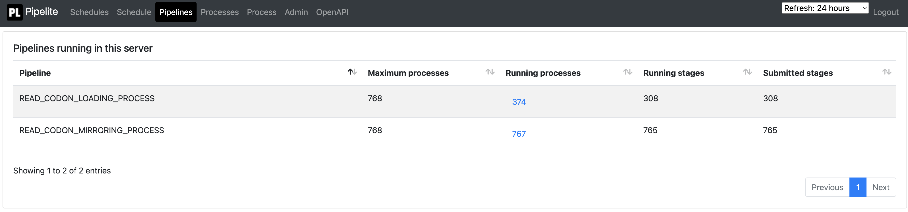
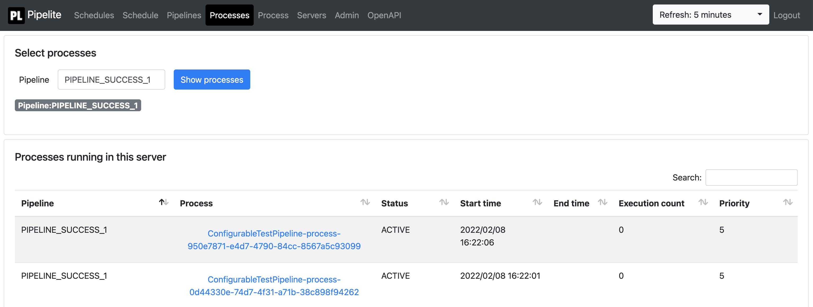
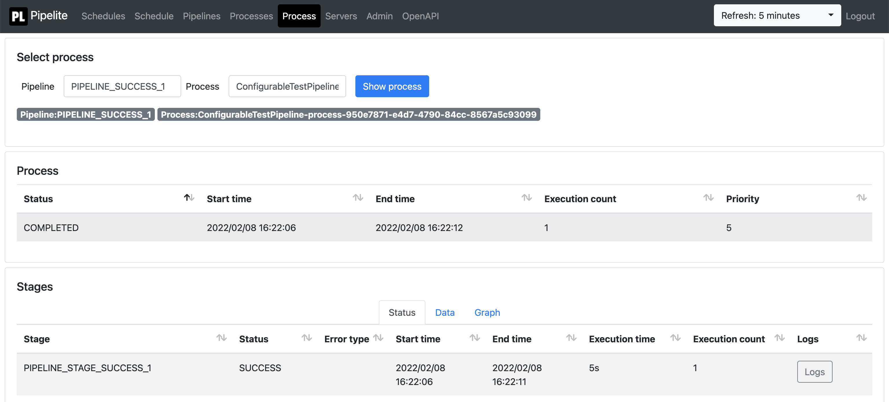

Pipelite workflow manager
=======

- [Overview](#overview)
- [How to start up Pipelite](#how-to-start-up-pipelite)
- [How to configure schedules](#how-to-configure-schedules)
  * [SimpleLsfExecutor example](#simplelsfexecutor-example)
- [How to configure pipelines](#how-to-configure-pipelines)
- [Stage dependency types](#stage-dependency-types)
- [Stage executor backends](#stage-executor-backends)
- [Configuration parameters](#configuration-parameters)
  * [Executor parameters](#executor-parameters)
    + [Cmd executor parameters](#cmd-executor-parameters)
    + [Simple LSF executor parameters](#simple-lsf-executor-parameters)
    + [LSF executor parameters](#lsf-executor-parameters)
    + [AwsBatch executor parameters](#awsbatch-executor-parameters)
  * [Service parameters](#service-parameters)
  * [Mail parameters](#mail-parameters)
  * [Database parameters](#database-parameters)
  * [Advanced parameters](#advanced-parameters)
  * [Test profiles](#test-profiles)
  * [Environment variables for unit testing](#environment-variables-for-unit-testing)
- [Database schema](#database-schema)
  * [PIPELITE2_SCHEDULE table](#pipelite2-schedule-table)
  * [PIPELITE2_PROCESS table](#pipelite2-process-table)
  * [PIPELITE2_STAGE table](#pipelite2-stage-table)
  * [PIPELITE2_STAGE_LOG table](#pipelite2-stage-log-table)
  * [PIPELITE2_SERVICE_LOCK table](#pipelite2-service-lock-table)
  * [PIPELITE2_PROCESS_LOCK table](#pipelite2-process-lock-table)
- [Web interface](#web-interface)
  * [Schedules](#schedules)
  * [Schedule](#schedule)
  * [Pipelines](#pipelines)
  * [Processes](#processes)
  * [Process](#process)
  * [Admin](#admin)

<small><i><a href='http://ecotrust-canada.github.io/markdown-toc/'>Table of contents generated with
markdown-toc</a></i></small>

### Overview

Pipelite is a workflow manager that executes pipelines or schedules. Pipelines are used for parallel executions of
processes. Schedules are used for executing processes according to a cron schedule. Only one scheduled process can be
active for a pipeline at any given time.

Pipeline starts up a web service with a basic monitoring interface, takes care of the pipeline and schedule executions
and stores the execution state in a relational database.

Please note that no new classes should be added to the ```pipelite```  package or any of its sub-packages except for
pipeline and schedule configurations that should be in ```pipelite.pipeline``` and ```pipelite.schedule``` packages.
This will allow pipeline and schedule configurations to be picked up pipelite while no other classes will accidentially
override any pipelite classes.

### How to start up Pipelite

Pipelite is a Spring java application distributed as a regular maven jar archive. The jar should be added as a
dependency to a application that registers pipelines and schedules to be executed by Pipelite.

A minimal build.gradle could contain:

```gradle
plugins {
id 'org.springframework.boot' version '2.4.0'
id 'io.spring.dependency-management' version '1.0.10.RELEASE'
}

dependencies {
implementation 'org.springframework.boot:spring-boot-starter'
implementation 'pipelite:pipelite:1.0.89'
}
```

and the minimal application would call  ```Pipelite.main``` to start up the Pipelite services:

```java

@SpringBootApplication
public class Application {
  public static void main(String[] args) {
    Pipelite.main(args);
  }
}
```

The ```SpringApplication``` can be configured using a ```Consumer<SpringApplication>``` callback:

```java

@SpringBootApplication
public class Application {
  public static void main(String[] args) {
    Consumer<SpringApplication> applicationConsumer = ...;
    Pipelite.main(args, applicationConsumer);
  }
}
```

### How to configure schedules

Schedules are used for executing processes according to a cron schedule.

Schedules are registered by implementing the ```Pipelite.Schedule``` interface and using the ```@Component```
annotation.

Schedules should be declared in the ```pipelite.schedule``` package to allow the configurations to be picked up
pipelite.

#### SimpleLsfExecutor example

A schedule executed using ```SimpleLsfExecutor``` over ssh would look like the following:

```java

@Component
public class MySchedule implements Pipelite.Schedule {

  @Override
  public String pipelineName() {
    // A unique name for the schedule.  
    return "MySchedule";
  }

  @Override
  public Options configurePipeline() {
    // The cron expression for the schedule.
    return new Options().cron("* * * * *");
  }

  @Override
  public void configureProcess(ProcessBuilder builder) {
    // A process with two stages is configured here. As the stages do not 
    // depend on each other they will be executed in parallel.
    builder
            // Execute STAGE1 stage that does not depend on any other stage.
            // Different executeXXX methods exist for different types of stage dependencies.
            .execute("STAGE1")
            // Execute STAGE1 using SimpleLsfExecutor with the provided stage execution parameters.
            // Different withXXX methods exist for different execution backends.
            .withSimpleLsfExecutor(STAGE_CMD1, STAGE_PARAMS)
            // Execute STAGE2 stage that does not depend on any other stage.
            // Different executeXXX methods exist for different types of stage dependencies.
            .execute("STAGE2")
            // Execute STAGE2 using SimpleLsfExecutor with the provided stage execution parameters.
            // Different withXXX methods exist for different execution backends.
            .withSimpleLsfExecutor(STAGE_CMD2, STAGE_PARAMS);
  }

  // The command line command to execute in STAGE1.
  private static final String STAGE_CMD1 = "...";

  // The command line command to execute in STAGE2.
  private static final String STAGE_CMD2 = "...";

  // SimpleLsfExecutor stage execution parameters are defined here. They can be shared
  // between stages or each stage can be configured with different parameters.
  private static final SimpleLsfExecutorParameters STAGE_PARAMS =
          SimpleLsfExecutorParameters.builder()
                  // How may times stages are immediately retried if their execution fails.
                  .immediateRetries(2)
                  // Applies only to pipelines.
                  // The maximum number of times a stage is retried if its execution fails.
                  // Stage executions are temporary stopped if immediate retries have 
                  // been exhausted and retried later until maximum retries is exceeded.                    
                  .maximumRetries(5)
                  // The number of CPU cores required to execute the stage.
                  .cpu(1)
                  // The amount of memory required to execute the stage.
                  .memory(16)
                  // The requested memory units.
                  .memoryUnits("M")
                  // The timeout after which the stage execution will be considered as failed.
                  .timeout(Duration.ofMinutes(30))
                  // The LSF login node.
                  .host("TODO")
                  // The LSF queue.
                  .queue("TODO")
                  // The LSF log directory where stage specific output files are written.
                  .logDir("pipelite_tmp")
                  .build();
}
```

### How to configure pipelines

Pipelines are used for executing unscheduled process instances.

Pipelines are registered by implementing the ```Pipelite.Pipeline``` interface and using the ```@Component```
annotation.

Pipelines should be declared in the ```pipelite.pipeline``` package to allow the configurations to be picked up
pipelite.

A pipeline would look like the following:

```java

@Component
public class MyPipeline implements Pipelite.Pipeline {

  // Identical to schedule configuration except for the configurePipeline method.
  // Please refer to the schedule configuration examples for more information.

  @Override
  public Options configurePipeline() {
    // The maximum number of parallel process executions.
    return new Options().pipelineParallelism(10);
  }

  @Override
  public PrioritizedProcess nextProcess() {
    // To be implemented by the user.
  }

  @Override
  public void confirmProcess(String processId) {
    // To be implemented by the user.
  }
```

The ```nextProcess``` method is called by Pipelite and should return ```Process``` instances or null if no new processes
are available at the time. The ```Process``` contains the process id and its priority for the new process.

The ```confirmProcess``` method is called by Pipelite to confirm that the process with the ```processId``` has been
registered for execution. This ```processId``` should no longer be returned by ```nextProcess```. However, if it is then
it will simply be ignored.

An alternative to defining ```nextProcess``` and ```confirmProcess``` is to directly insert processes to be executed
into the ```PIPELITE2_PROCESS``` table. For example:

```sql
--  New process with default priority (5). Priority is between 9 (highest) and 0 (lowest).
insert into pipelite2_process(pipeline_name, process_id)
values ('testPipelite', 'testProcess1');


--  New process with priority 4. Priority is between 9 (highest) and 0 (lowest).
insert into pipelite2_process(pipeline_name, process_id, priority)
values ('testPipelite', 'testProcess2', 4);
```

### Stage dependency types

The following dependency types are supported by the ProcessBuilder:

- ```execute(String stageName)```: the stage 'stageName' is not dependent on any other stage
- ```executeAfter(String stageName, String dependsOnStageName)```: the stage 'stageName' depends on stage '
  dependsOnStageName' and will be executed only after 'dependsOnStageName' has completed successfully
- ```executeAfter(String stageName, List<String> dependsOnStageName)```: the stage 'stageName' depends on a list of
  stages 'dependsOnStageName' and will be executed only after all 'dependsOnStageName' stages has completed successfully
- ```executeAfterPrevious(String stageName)```: the stage 'stageName' depends on the previous stage declared in the
  ProcessBuilder and will be executed only after it has completed successfully
- ```executeAfterFirst(String stageName)```:  the stage 'stageName' depends on the first stage declared in the
  ProcessBuilder and will be executed only after it has completed successfully

### Stage executor backends

The following executor backends are supported by the ProcessBuilder:

- ```withKubernetesExecutor```: a Kubernetes executor that runs images.
- ```withCmdExecutor```: a local or ssh command executor. Ssh will be used if ```host``` has been set
  in ```CmdExecutorParameters```.
- ```withLsfExecutor```: an LSF executor that uses YAML configuration files with parameter placeholders. Ssh will be
  used if ```host``` has been set in ```LsfExecutorParameters```.
- ```withSimpleLsfExecutor```: an LSF executor that uses a small subset of common LSF parameters. Ssh will be used
  if ```host``` has been set in ```SimpleLsfExecutorParameters```.
- ```withAwsBatchExecutor```: an experimental AwsBatch executor that uses JSON configuration files with parameter
  placeholders.
- ```with```: any executor that implements the ```StageExecutor``` interface.
- ```withSyncTestExecutor```: A test executor that behaves like a synchronous executor.
- ```withAsyncTestExecutor```: A test executor that behaves like an asynchronous executor.

### Configuration parameters

#### Executor parameters

Executor parameters provide default values for all ```ProcessBuilder``` stage parameters and are used in cases where the
value is not overriden in ```ProcessBuilder```.

##### Common executor parameters

The following parameters are available for all executors. Please replace '*' below with the executor name (e.g. '
kubernetes').

- pipelite.executor.*.immediateRetries: the maximum number of times a stage will be re-executed immediately in case of a
  non-permanent error. If immediate retries is larger than maximumRetries it will be set to the same value as
  maximumRetries. Default value: 3
- pipelite.executor.*.maximumRetries: the maximum number of times a stage will be re-executed in case of a non-permanent
  error before it is considered as failed. Default value: 3
- pipelite.executor.*.permanentErrors: exit codes that are considered permanent errors that will not be retried.
- pipelite.executor.*.logSave: the concatenated stdout and stderr output of the stage execution can be saved into the
  pipelite database: ALWAYS saves the output, ERROR saves the output if the stage execution failed, NEVER does not save
  the output. Default value: ERROR.
- pipelite.executor.*.logLines: the number of last lines from the output file saved in the stage log. Default value:
  1000

##### Kubernetes executor parameters

- pipelite.executor.kubernetes.context: the Kubernetes context.
- pipelite.executor.kubernetes.namespace: the Kubernetes namespace. Default value: 'default'.
- pipelite.executor.kubernetes.cpu: the Kubernetes pod cpu request
- pipelite.executor.kubernetes.memory: the Kubernetes pod memory request
- pipelite.executor.kubernetes.cpuLimit: the Kubernetes pod cpu limit
- pipelite.executor.kubernetes.memoryLimit: the Kubernetes pod memory limit

Kubernetes cluster configuration options are described in
https://github.com/fabric8io/kubernetes-client#configuring-the-client. Be default, the cluster configuration is read
from the kubeconfig file in ~/.kube/config. The kubeconfig file location can also be given using the system property '
kubeconfig' or the environmental variable KUBECONIG.

Kubernetes cpu and memory requests and limits are described in:
https://kubernetes.io/docs/concepts/configuration/manage-resources-containers/.

##### Cmd executor parameters

- pipelite.executor.cmd.host: the remote host. Ssh will be used if the ```host``` has been set.
- pipelite.executor.cmd.user: the user used to connect to the remote host. Default value: the user who restarted the
  Pipelite service
- pipelite.executor.cmd.env: the environmental variables passed to the command executor

##### Simple LSF executor parameters

- pipelite.executor.simpleLsf.host: the remote host. Ssh will be used if the ```host``` has been set.
- pipelite.executor.simpleLsf.user: the user used to connect to the remote host. Default value: user who restarted the
  Pipelite service
- pipelite.executor.simpleLsf.env: the environmental variables passed to the command executor
- pipelite.executor.simpleLsf.queue: the queue name
- pipelite.executor.simpleLsf.cpu: the number of requested cpus (-n option)
- pipelite.executor.simpleLsf.memory: the amount of requested memory (-M and -R rusage[mem=] option)
- pipelite.executor.simpleLsf.memoryUnits: the LSF memory units (-M and -R rusage[mem=] option)
- pipelite.executor.simpleLsf.memoryTimeout: the LSF memory duration (-R rusage[mem=:duration=] option)
- pipelite.executor.simpleLsf.jobGroup: the LSF job group name (-g option)
- pipelite.executor.simpleLsf.logDir: the directory where stage log files are written: <logDir>/<user>
  /<pipeline>/<process>. The <logDir> must exist on the LSF cluster and must be writable on the LSF execution nodes.
- pipelite.executor.simpleLsf.logTimeout: the maximum wait time for the stage log to become available. Default value: 10
  seconds

The unit for the resource usage limit can be one of:

- KB or K (kilobytes)
- MB or M (megabytes)
- GB or G (gigabytes)
- TB or T (terabytes)
- PB or P (petabytes)
- EB or E (exabytes)
- ZB or Z (zettabytes)

##### LSF executor parameters

- pipelite.executor.lsf.host: the remote host. Ssh will be used if the ```host``` has been set.
- pipelite.executor.lsf.user: the user used to connect to the remote host. Default value: user who restarted the
  Pipelite service
- pipelite.executor.lsf.env: the environmental variables passed to the command executor
- pipelite.executor.lsf.definition: the job definition resource name, file name or URL
- pipelite.executor.lsf.format: the job definition file format: YAML, JSON, or JSDL
- pipelite.executor.lsf.parameters: the job definition parameters applied to the job definition file. The key is the
  parameter placeholder that if found in the job definition file will be replaced with the corresponding value.
- pipelite.executor.lsf.definitionDir: the directory where stage definition files are written: <definitionDir>/<user>
  /<pipeline>/<process>. The <definitionDir> must exist on the LSF cluster and must be writable on the LSF submission
  nodes.
- pipelite.executor.lsf.logDir: the directory where stage log files are written: <logDir>/<user>
  /<pipeline>/<process>. The <logDir> must exist on the LSF cluster and must be writable on the LSF execution nodes.
- pipelite.executor.lsf.logTimeout: the maximum wait time for the stage log to become available. Default value: 10
  seconds

##### AwsBatch executor parameters

- pipelite.executor.awsBatch.region: the AWS region name
- pipelite.executor.awsBatch.queue: the job queue
- pipelite.executor.awsBatch.definition: The job definition name, name:revision or ARN
- pipelite.executor.awsBatch.parameters: the job definition parameters applied to the job definition by AWSBatch

#### Service parameters

- pipelite.service.name: the name of the pipeline service. Only one service with the same name can be active at one
  time. Default value: hostname:port
- pipelite.service.port: the http port for the pipeline web interface. Default value: 8083
- pipelite.service.contextPath: the http port for the pipeline web interface. Default value: /pipelite
- pipelite.service.username: the pipelite web service username. Default value: pipelite
- pipelite.service.password: the pipelite web service password. Default value: pipelite
- pipelite.service.shutdownPeriod: the pipelite service shutdown period to allow the service to finish gracefully.
  Minimum value: 10 seconds. Default value: 1 minute.
- pipelite.service.force: forces the pipelite service to start by removing all service locks and by updating service
  names attached to schedules if necessary. Default value: false

#### Mail parameters

- pipelite.mail.host: the SMTP host
- pipelite.mail.port: the SMTP port
- pipelite.mail.from: the email sender
- pipelite.mail.to: the email recipient(s)
- pipelite.mail.starttls: is starttls enabled. Default value: false
- pipelite.mail.username: the SMTP username for authentication purposes (optional)
- pipelite.mail.password: the SMTP username for authentication purposes (optional)
- pipelite.mail.processFailed: send an email when process fails. Default: true
- pipelite.mail.processCompleted: send an email when process completes. Default: false
- pipelite.mail.stageError: send an email when stage fails. Default: true
- pipelite.mail.stageSuccess: send an email when stage succeeds. Default: false

#### Datasource parameters

- pipelite.datasource.driverClassName: JDBC driver class name
- pipelite.datasource.url: JDBC URL
- pipelite.datasource.username: JDBC username
- pipelite.datasource.password: JDBC password
- pipelite.datasource.ddlAuto: see Hibernate hbm2ddl.auto options
- pipelite.datasource.dialect: see Hibernate dialect options
- pipelite.datasource.minimumIdle: minimum number of database connections in the connection pool. Default value: 10
- pipelite.datasource.maximumPoolSize: maximum number of database connections in the connection pool. Default value: 25
- pipelite.datasource.test: if set to true and if no valid datasource configuration has been provided then uses an in
  memory database unsuitable for production purposes. Default value: false

#### Advanced parameters

- pipelite.advanced.lockFrequency: the frequency of renewing service locks. Default value: 5 minutes
- pipelite.advanced.lockDuration: the duration after which service and process locks expire unless the service lock is
  renewed. Default value: 60 minutes
- pipelite.advanced.processRunnerFrequency: the running frequency for executing new processes. Default value: 1 second
- pipelite.advanced.processRunnerWorkers: the number or parallel workers running processes in the main event loop.
  Default value: 25
- pipelite.advanced.processQueueMinRefreshFrequency: the minimum frequency for process queue to be refreshed to allow
  process re-prioritisation. Default value: 10 minutes
- pipelite.advanced.processQueueMaxRefreshFrequency: the maximum frequency for process queue to be refreshed to allow
  process re-prioritisation. Default value: 4 hours
- pipelite.advanced.processQueueMinReplenishFrequency: the minimum frequency for process queue to be replenished.
  Default value: 10 minutes
- pipelite.advanced.processQueuePriorityPolicy: the process queue prioritisation policy. Default value: BALANCED
- pipelite.advanced.mailLogBytes: the maximum number of log bytes in mail for failed stage executions

#### Test profiles

- if Spring active profiles contain 'test' then uses HSQLDB in-memory database unsuitable for production purposes.

#### Environment variables for unit testing

The following environment variables are mandatory for running the unit tests:

- PIPELITE_TEST_DATABASE_DRIVER
- PIPELITE_TEST_DATABASE_URL
- PIPELITE_TEST_DATABASE_USERNAME
- PIPELITE_TEST_DATABASE_PASSWORD

Example values when using the HSQLDB in-memory database:

- PIPELITE_TEST_DATABASE_DRIVER: org.hsqldb.jdbc.JDBCDriver
- PIPELITE_TEST_DATABASE_URL: jdbc:hsqldb:mem:testdb;DB_CLOSE_DELAY: -1
- PIPELITE_TEST_DATABASE_USERNAME: sa
- PIPELITE_TEST_DATABASE_PASSWORD:

Ssh unit tests require the following environment variables:

- PIPELITE_TEST_SSH_HOST
- PIPELITE_TEST_SSH_USER

Lsf unit tests require the following environment variables:

- PIPELITE_TEST_LSF_HOST
- PIPELITE_TEST_LSF_USER
- PIPELITE_TEST_LSF_LOG_DIR
- PIPELITE_TEST_LSF_DEFINITION_DIR
- PIPELITE_TEST_LSF_QUEUE

### Database schema

#### PIPELITE2_SCHEDULE table

The Pipeline schedules are stored in this table with associated execution information.

- SERVICE_NAME: The Pipeline service name
- PIPELINE_NAME: the pipeline name
- CRON: the cron schedule
- DESCRIPTION: a human readable description of the cron schedule
- PROCESS_ID: running process id
- EXEC_START: last execution start date
- EXEC_END: last execution end date
- EXEC_NEXT: next scheduled execution start time
- EXEC_CNT: number of executions
- LAST_COMPLETED: time when the schedule was last executed successfully
- LAST_FAILED: time when the schedule last failed
- STREAK_COMPLETED: number of uninterrupted successful executions
- STREAK_FAILED: number of uninterrupted failed executions

#### PIPELITE2_PROCESS table

The Pipeline processes are stored in this table with associated execution information.

- PIPELINE_NAME: the pipeline name
- PROCESS_ID: the process id
- STATE: process state PENDING, ACTIVE, FAILED, COMPLETED, CANCELLED
- EXEC_CNT: number of executions
- EXEC_START: execution start time
- EXEC_END: execution end time
- PRIORITY: process priority from 0 (lowest) to 9 (highest)

#### PIPELITE2_STAGE table

The Pipeline process stages are stored in this table with associated execution information.

- PIPELINE_NAME: the pipeline name
- PROCESS_ID: the process id
- STAGE_NAME: the stage name
- STATE: stage state PENDING, ACTIVE, SUCCESS, ERROR
- EXEC_CNT: number of executions
- EXEC_START: execution start time
- EXEC_END: execution end time
- EXEC_NAME: the stage executor name
- EXEC_DATA: the stage executor data
- EXEC_PARAMS: the stage executor parameters
- EXEC_RESULT_PARAMS: the stage executor result parameters

#### PIPELITE2_STAGE_LOG table

The Pipeline process stage logs are stored in this table.

- PIPELINE_NAME: the pipeline name
- PROCESS_ID: the process id
- STAGE_NAME: the stage name
- STAGE_LOG: the configured number of last bytes of the stdout and stderr output of the stage execution

#### PIPELITE2_SERVICE_LOCK table

This table contains Pipelite service locks. Only one service with a given name is permitted to be running at one time.

- LOCK_ID: a unique lock id
- SERVICE_NAME: The Pipeline service name
- HOST: the Pipeline service host
- PORT: the Pipeline service port
- CONTEXT_PATH: the Pipeline service context path
- EXPIRY: The Pipeline service lock expiry time

#### PIPELITE2_PROCESS_LOCK table

This table contains Pipelite process locks. Each process is allowed to be executed only by one service at one time.

- SERVICE_NAME: The Pipeline service name
- PIPELINE_NAME: the pipeline name
- PROCESS_ID: the process id

### Web interface

The Pipeline web interface consists of a number of pages briefly explained below. The same functionality is available
through a REST API documented using OpenAPI3.

#### Schedules

The Schedules page shows information for all schedules running on the Pipelite service.


#### Schedule

The Schedule page shows the execution history for one schedule.


#### Pipelines

The Pipelines page shows information for all pipelines running on the Pipelite service.



#### Processes

The Processes page shows information for all active processes (both from schedules and pipelines) running on the
Pipelite service.



#### Process

The Process page shows information for a specific process given pipeline name and process id.



#### Admin

The Admin page exposes a number of administrative actions.


