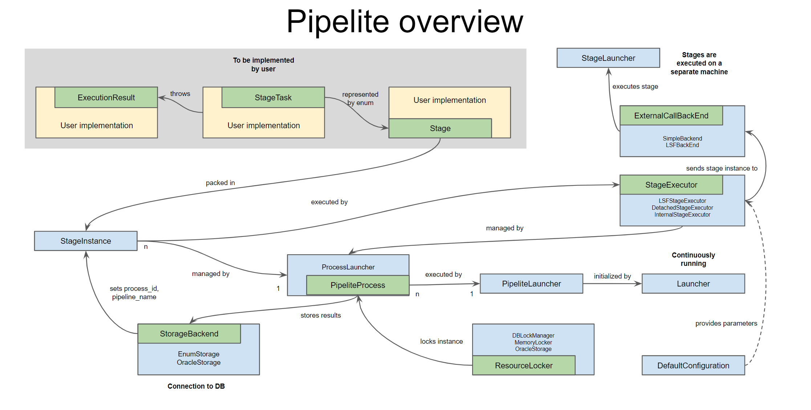

# Pipelite. Lightweight pipeline engine.


## Configuration.

There is a configuration file that you need to supply to Pipelite each time you run it.


## Properties

Current property set is looking now like:

```
pipelite.pipeline.name=[pipeline_name]
pipelite.stage.table.name=[<stage> table]
pipelite.log.table.name=[<log> table]
pipelite.stages.redo.count=[number of redo times for commit statuses that have canRedo set to true]
pipelite.process.table.name=[<process> table]
pipelite.stages.enum=[full enum name for pipeline stages]
pipelite.commit.status.enum=[full enum name for pipeline commit statuses]
pipelite.default.mail-to=[default mail recipient for error logs]
pipelite.default.lsf-cores=[number of cores available for a process]
pipelite.default.lsf-queue=[lsf queue name]
pipelite.default.lsf-mem=[memory requested for each lsf job (in megs)]
pipelite.default.lsf-mem-timeout=[lsf memory timeout (in minutes)]
pipelite.default.lsf-output-redirection=[log directory. can't be local]
pipelite.smtp.server=[smtp server for errors message submission]
pipelite.smtp.mail-from=[from field in e-mail]
pipelite.jdbc.driver=[class name for jdbc driver]
pipelite.jdbc.url=[database connect string]
pipelite.jdbc.user=[database user]
pipelite.jdbc.password=[database password]
pipelite.properties.pass=[list of system properties separated by ":" to pass from supervisor jvm to stage jvm]
```

## Enums

Descriptions of pipeline stages (property `pipelite.stages.enum`) and commit statuses
(property `pipelite.commit.status.enum`) should be implemented via java enums.
Stages should implement `Stage` interface.

```java
public interface 
Stage
{
    public Class<? extends StageTask> getTaskClass();
    public Stage getDependsOn();
    public String getDescription();
    default public int getMemoryLimit() { return -1; }
    default public int getCPUCores() { return 1; }
    default public String[] getPropertiesPass() { return new String[] {}; }
    default public ExecutorConfig[] getExecutorConfig() { return new ExecutorConfig[] {}; }
}
```

Where:
*	`getTaskClass` returns actual class responsible for particular stage
*	`getDependsOn` returns stage from the stage depends on. null if no dependencies.
Dependencies used to resolve following dependant stages to clean results in case of failures in
current stage.
*	`getDescription` (String) Textual description for the stage
* `getMemoryLimit` (int) optional. Memory limitation for the stage 
* `getCPUCores` (int) optional. CPU cores number limitation for the stage 
* `getPropertiesPass` (String[]) optional. Array of names of system properties to pass from supervisor jvm to backend jvm
* `getExecutorConfig` (ExecutorConfig[]) optional. Array of objects of a class extending `ExecutorConfig`. Used to pass backend specific configurations

Note: `stage name (toString())` is used in current version to obtain name for `<stage_table_id>`
field. One  needs a good reason to override this method in  their stage enum.
Note: With LSF backend `getMemoryLimit` sets memory limit per LSF process,
JVM memory limit will be automatically set to `getMemoryLimit - 1500` if possible or will not be set otherwise.

It is possible to set stage specific parameters for LSF backend using `getExecutorConfig`.
For that the array returned by `getExecutorConfig` must contain object overriding `LSFExecutorConfig`.
LSF backend specific parameters are returned by the following `LSFExecutorConfig` methods:
* `getLSFMemoryReservationTimeout` (int) memory reservation timeout in seconds
* `getLsfQueue` (String) LSF queue name
* `getLsfOutputPath` (String) path for LSF output files

Commit statuses enum should implement `ExecutionResult`. The purpose of it to translate return
codes (byte) and `Throwables` to human readable messages and back.

```java
public interface
ExecutionResult
{
    public boolean            canRedo();
    public byte               getExitCode();
    public Class<Throwable>   getCause();
    public String             getMessage();
}
```

*	`canRedo` - returns true if stage can be re-processed having its process_date already set to
not null
*	`getExitCode` - returns return code belonging to the commit status. Should be unique for the enum
*	`getCause` - returns throwable cause of commit status. Should be unique for the enum
*	`getMessage` - returns commit status message which would be inserted into `process_error` field of
`<stage>` table. Also used for obtaining commit status by given database row.


## Stage tasks
Each stage class should implement `StageTask` interface

```java
public interface
StageTask
{
	public void    init( Object id, boolean is_forced ) throws Throwable;
	public void    execute() throws Throwable;
	public void    unwind();
}
```

Where:
* `init` – initialises stage
*	`execute` – executes stage’s processing code
*	`unwind` – de-initialises stage

Note:
*	`Throwable` thrown by execute method is used to resolve exit code for the stage and then,
the exit code is used to resolve commit message for database.
*	Classes implement `StageTask` should have constructors without parameters.

Pipelite structure and endpoints overview is presented below



Inner interfaces and classes (file submission pipeline is used as an example):

* Launcher: initializes pipelite components (pipelite launcher, storage, task source)
* PipeliteLauncher: executes processes in a thread pool
* PipeliteProcess (ProcessLauncher): provides stage instances to a stage executor
* ResourceLocker (DBLockManager, MemoryLocker, OracleStorage): manages locking for prevention of process overlapping
* StageExecutor (LSFStageExecutor, DetachedStageExecutor, InternalStageExecutor): executes stage instances on a dedicated machine (depends on implementation)
* StageInstance: instance of a stage with process id and other parameters
* Stage (Stages): enum containing all stage tasks of a given implementation
* StageTask (ARCHIVE, MANIFEST): implementation of a task to be executed by piplite
* StorageBackend (EnumStorage, OracleStorage): connection to database
* DefaultConfiguration: launch configurations


## Database structure

Following tables and fields must be presented in database schema. Naming of `<fields>` is up to user
but corresponding property values should be set. Locking mechanism is used to prevent an execution
of multiple instances of the same stage. Amount of simultaneously running processes are determined
by number of rows in `<lock> table`. As one row will be taken by `supervisor process`, there must be 
at least two rows to make Pipelite work. To make Pipelite execute the stage a row with
`<pipeline_name>`, `<process_id>` and `<stage name>` must be added to `<stage> table` and a row with
corresponding `<pipeline_name>` and `<process_id>` must be added to `<process> table`. It is
recommended to perform these operations in a single transaction. Logging output is stored in 
`<log> table`.

### \<process> table

name | nullable | type
--- | --- | ---
<pipeline_name> | not null | varchar2(64)   
<process_id>    | not null | varchar2(15)   
priority        | not null | number(1)      
state           | not null | varchar2(16)   
state_comment   |          | varchar2(4000) 
audit_time      | not null | date           
audit_user      | not null | varchar2(30)   
audit_osuser    | not null | varchar2(30)   
exec_cnt        | not null | number(5)      


### \<stage> table

name | nullable | type
--- | --- | ---
<pipeline_name>  | not null | varchar2(64)  
<process_id>     | not null | varchar2(15)  
<stage_name>     | not null | varchar2(255) 
exec_cnt         | not null | number(5)     
exec_date        |          | date          
exec_result      |          | varchar2(255) 
audit_time       | not null | date          
audit_user       | not null | varchar2(30)  
audit_osuser     | not null | varchar2(30)  
enabled          | not null | char(1)       
exec_id          |          | number(16)    
exec_start       |          | date          
exec_result_type |          | varchar2(64)  
exec_stdout      |          | clob          
exec_stderr      |          | clob          
exec_cmd_line    |          | clob          


### \<log> table

name | nullable | type
--- | --- | ---
<pipeline_name> | not null | varchar2(64)   
<process_id>    | not null | varchar2(15)   
<stage_name>    | not null | varchar2(255)  
log_date        | not null | date           
message         |          | varchar2(255)  
exception       |          | varchar2(4000) 
jobid           |          | number(10)     
hosts           |          | varchar2(255)  
exec_id         |          | number(16)     


### \<lock> table

name | nullable | type
--- | --- | ---
<pipeline_name>  | not null | varchar2(64)  
lock_id          |          | varchar2(255) 
allocator_name   |          | varchar2(255) 
audit_time       | not null | date          
audit_user       | not null | varchar2(30)  
audit_osuser     | not null | varchar2(30)  


## Classes

Following classes can be launched using command line. Note current implementation of the Pipelite
needs database structure for particular process instance be  present in data base before launch
(e.g, for each process id that user wants to process there should be row in `<process>` table with
id and row(s) in `<stage>` table with corresponding prosess ids and names of the stages)

### uk.ac.ebi.ena.sra.pipeline.launcher.Launcher
Launches supervisory program which interact with database and spawns sub-processes
(currently only LSF back-end supported). Does not do any database locking itself, all locking
done by calling ProcessLauncher class. Creates file lock to prevent occasional execution of copy.
Command line parameters are:
*	--workers \<number> - number of simultaneously working processes. default value is: `10`;
*	--lock \<path> - lock file path, default is `/var/tmp/.launcher.lock`
*	--queue \<queue_name> - LSF queue name, default is `research-rh6`
*	--mail-to \<list> - comma-separated list of mail addresses, default is `pipelite.default.mail-to`
value
*	--lsf-user \<user>- user for LSF reports, default is `pipelite.default.lsf-user` value
*	--lsf-mem \<number> - memory for single LSF job, default is `pipelite.default.lsf-mem` value
*	--log-file \<path> - log file, default is `/var/tmp/launcher.log`

### uk.ac.ebi.ena.sra.pipeline.launcher.ProcessLauncher
Launches execution for process ID, also interacts with data base. Locks corresponding process' and
stage' table rows.

* --executor - executor class (backend)
*	--stage \<stage_name> - stage name to execute
*	--mail-to \<list> - comma-separated list of mail addresses, default is: `pipelite.default.mail-to`
value

### uk.ac.ebi.ena.sra.pipeline.launcher.StageLauncher
Launches class for supplied stage. It does not lock process and stage tables but current version can
insert log records to log table.
*	--id  \<process_table_id> - process instance id to execute
*	--stage \<stage_name> - stage name to execute
*	--commit - force commit client data
* --enabled - flag for enabling/disabling stage
* --exec-cnt - execution counter for tracking


## Example project

https://github.com/enasequence/ena-pipelite-example
